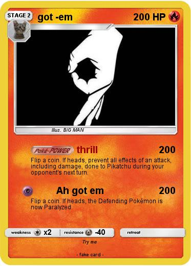

<!DOCTYPE html>
<html lang="en">
<head>
    <meta charset="UTF-8">
    <meta name="viewport" content="width=device-width, initial-scale=1.0">
    <title>Hola</title>
    
</head>
<body>
    <header>
        
    </header>
     
    <a href="markdown.md" target="_blank">
        <button>Get Code</button>
</body>
</html>